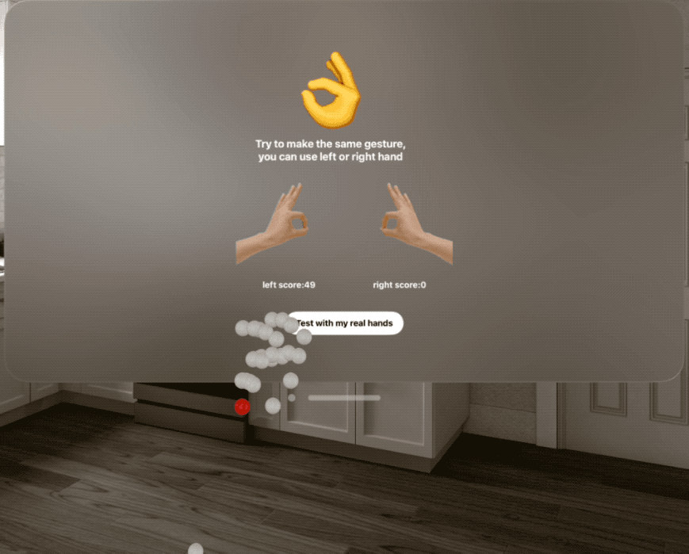

<p align="center">
    
</p>
<p align="center">
  <a href="https://github.com/apple/swift-package-manager"></a>
  
  
</p>

[中文版](./README_CN.md)

**HandVector** is a tool to calculate the similarity of hand gestures in visionOS, and with a macOS tool to test hand tracking in visionOS simulator.

<p align="center">
    <a href="#requirements">Requirements</a> • <a href="#usage">Usage</a> • <a href="#installation">Installation</a> • <a href="#contribution">Contribution</a> • <a href="#contact">Contact</a> • <a href="#license-mit">License</a>
</p>

## Requirements

- visionOS 1.0+
- Xcode 15.2+
- Swift 5.9+

## Usage

Your can run demo in package to see how to use it, and also can try an Vision Pro App: [FingerEmoji](https://apps.apple.com/us/app/fingeremoji/id6476075901)  in App Store to see how it works.



### Match hand gesture

`HandVector` allows you to track your hands, and calculate the similarity between your current hand to another recorded hand gesture:

```swift
import HandVector

//load recorded hand gesture from json file
model.handEmojiDict = HandEmojiParameter.generateParametersDict(fileName: "HandEmojiTotalJson")!
guard let okVector = model.handEmojiDict["👌"]?.convertToHandVectorMatcher(), let leftOKVector = okVector.left else { return }

//update current handTracking from HandTrackingProvider
for await update in handTracking.anchorUpdates {
    switch update.event {
    case .added:
        ...
    case .updated:
        let anchor = update.anchor
        guard anchor.isTracked else { continue }
        await latestHandTracking.updateHand(from: anchor)
    case .removed:
        ...
    }
}


//calculate the similarity
let leftScore = model.latestHandTracking.leftHandVector?.similarity(to: leftOKVector) ?? 0
model.leftScore = Int(abs(leftScore) * 100)
let rightScore = model.latestHandTracking.rightHandVector?.similarity(to: leftOKVector) ?? 0
model.rightScore = Int(abs(rightScore) * 100)
```

the score should be in `[-1.0,1.0]`, `1.0` means fully matched and both are left or right hands, `-1.0 `means fully matched but one is left hand, another is right hand, and `0` means not matched.

### Test on simulator

The test method of`HandVector`  is inspired by  [VisionOS Simulator hands](https://github.com/BenLumenDigital/VisionOS-SimHands),  it allow you to test hand tracking on visionOS simulator:

It uses 2 things:

1. A macOS helper app, with a bonjour service
2. A Swift class for your VisionOS project which connects to the bonjour service (already in this package, and already turn JSON data to hand gestures)

#### macOS Helper App

The helper app uses Google MediaPipes for 3D hand tracking. This is a very basic setup - it uses a WKWebView to run the Google sample code, and that passed the hand data as JSON into native Swift.

The Swift code then spits out the JSON over a Bonjour service.

> If hand tracking can't start for a long time(Start button still can't be pressed), please check your network to google MediaPipes.


### And many more...

To go further, take a look at the documentation and the demo project.

*Note: All contributions are welcome*

## Installation

#### Swift Package Manager

To integrate using Apple's Swift package manager, without Xcode integration, add the following as a dependency to your `Package.swift`:

```
.package(url: "https://github.com/XanderXu/HandVector.git", .upToNextMajor(from: "0.1.0"))
```

#### Manually

[Download](https://github.com/XanderXu/HandVector/archive/master.zip) the project and copy the `HandVector` folder into your project to use it.

## Contribution

Contributions are welcomed and encouraged *♡*.

## Contact

Xander: API 搬运工

* [https://twitter.com/XanderARKit](https://twitter.com/XanderARKit)
* [https://github.com/XanderXu](https://github.com/XanderXu)

 - [https://juejin.cn/user/2629687543092056](https://juejin.cn/user/2629687543092056)

   

## License

HandVector is released under an MIT license. See [LICENSE](./LICENSE) for more information.
