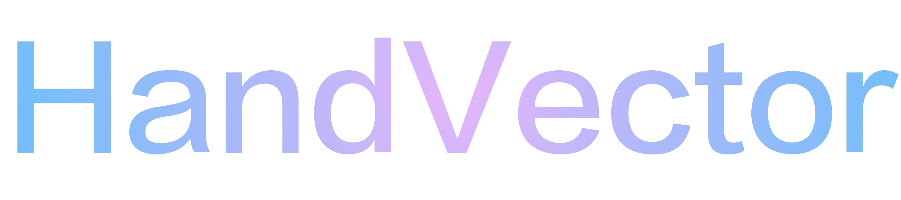
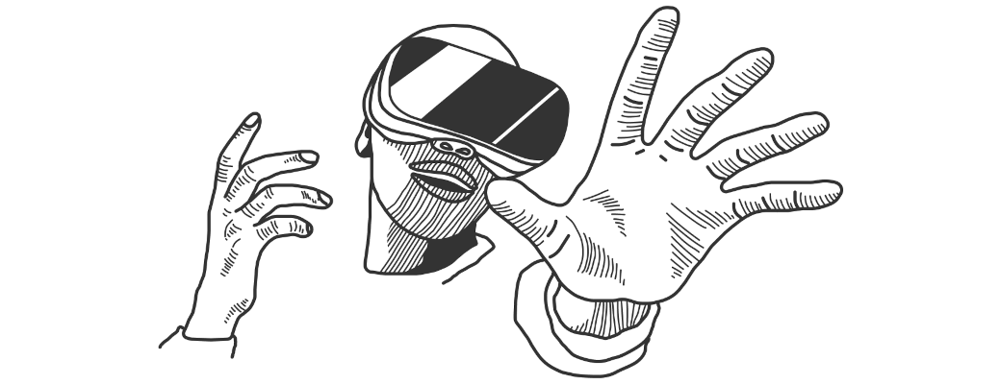
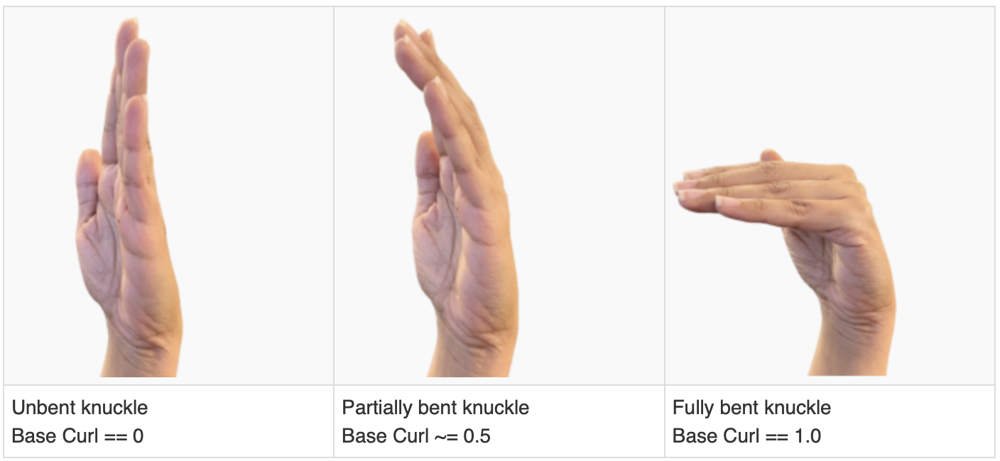
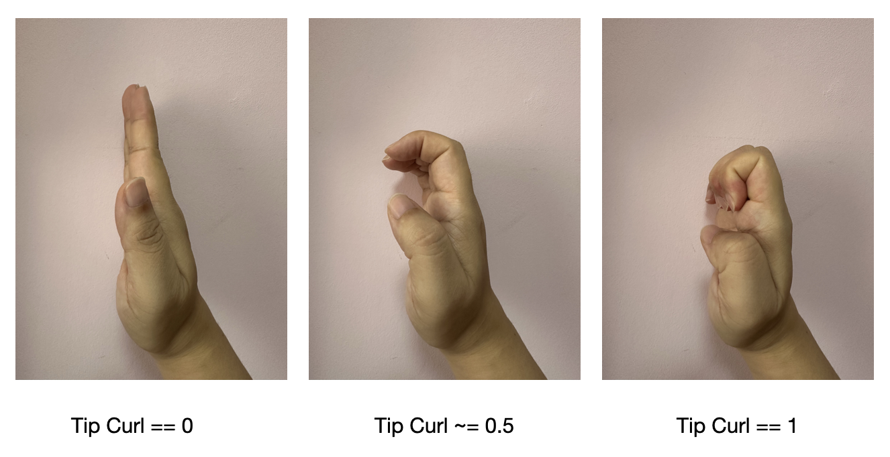
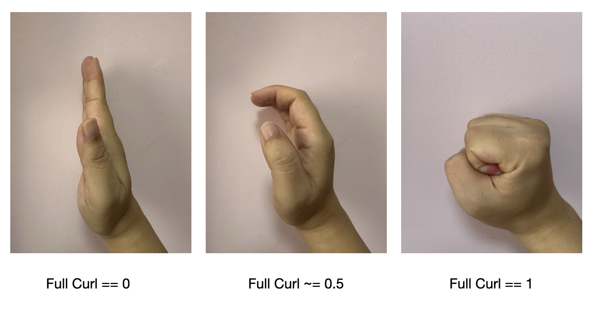
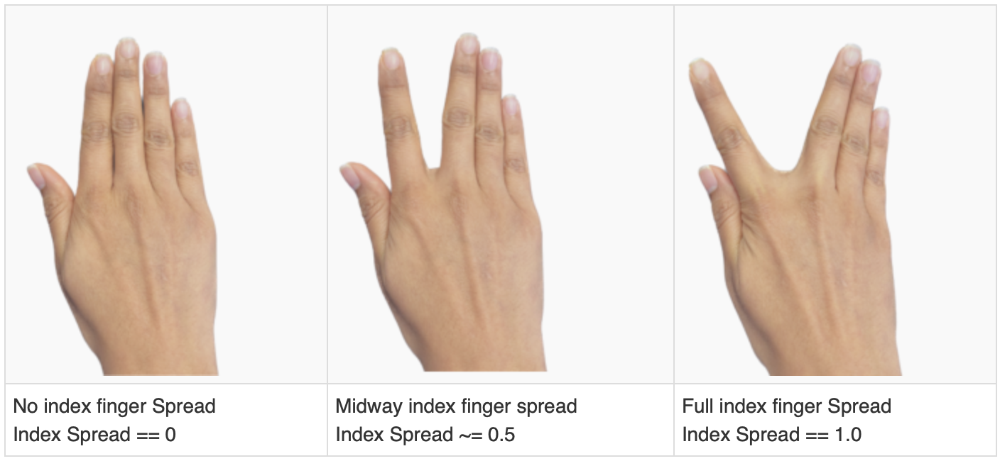
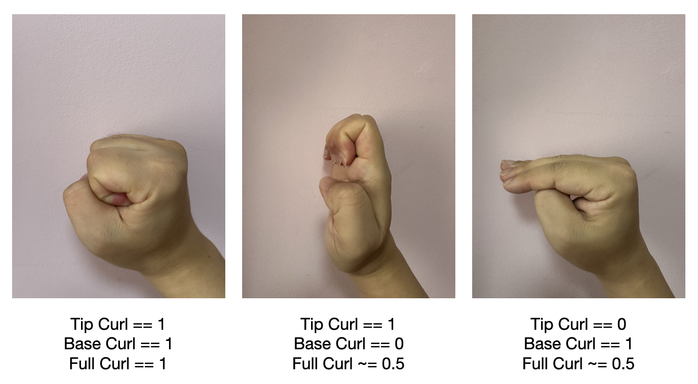
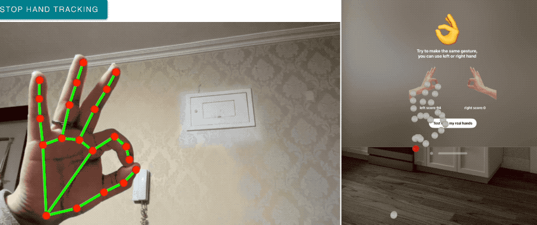

<p align="center">
    
</p>
<p align="center">
  <a href="https://github.com/apple/swift-package-manager"></a>
  
  
</p>

[中文版本](./README_CN.md)

[old version](./READMEv1/README.md)


**HandVector** calculates the similarity between different static gestures on visionOS and comes with a macOS utility class that allows you to use gesture tracking in the visionOS simulator as well.

HandVector version 2.0 is a major update, bringing the improved **Cosine Similarity**  and the **FingerShape** feature for easier customization.

> Note: HandVector 2.0 has significant API changes and is not compatible with older versions.

<p align="center">
    <a href="#requirements">Requirements</a> • <a href="#usage">Usage</a> • <a href="#installation">Installation</a> • <a href="#contribution">Contribution</a> • <a href="#contact">Contact</a> • <a href="#license-mit">License</a>
</p>

## Requirements

- visionOS 1.0+
- Xcode 15.2+
- Swift 5.9+

## Usage

`HandVector 2.0` supports two kinds of gesture matching methods, which differ in their calculation principles and are suitable for different scenarios. They can also be mixed used together in a project:

* **Cosine Similarity**: This method matches each joint of the specified fingers precisely, using the matrix information of each joint relative to its parent joint, resulting in high accuracy. Advantages: High precision, applicable to fingers and wrists; Disadvantages: Poor interpretability, difficult to adjust the range.
* **FingerShape**: Referencing Unity's [XRHands](https://docs.unity3d.com/Packages/com.unity.xr.hands@1.5/manual/index.html) framework, this method simplifies the finger shape into five parameters: `baseCurl` (curl at the base of the finger), `tipCurl` (curl at the tip of the finger), `fullCurl` (overall curl of the finger), `pinch` (distance of pinching with the thumb), and `spread` (degree of separation from the adjacent outer finger). Advantages: The values are easy to understand and convenient to control and adjust; Disadvantages: Does not fully utilize joint pose information, thus not as precise, and is only applicable to five fingers.

### 1. Cosine Similarity Gesture Matching
`HandVector` supports matching built-in gestures as well as recording and saving custom gestures for later use. Currently, there are 8 built-in gestures: 👆✌️✋👌✊🤘🤙🫱🏿‍🫲🏻
> 🫱🏿‍🫲🏻: Grab, grasp
#### a. Matching Built-in Gestures


```swift

import HandVector


//Get current Hand info from `HandTrackingProvider` , and convert to `HVHandInfo`

for await update in handTracking.anchorUpdates {

  switch update.event {

  case .added, .updated:

    let anchor = update.anchor

    guard anchor.isTracked else { continue }

    let handInfo = latestHandTracking.generateHandInfo(from: anchor)

  case .removed:

    ...

  }

}


//Load built-in gesture from json file

let builtinHands = HVHandInfo.builtinHandInfo

//Calculate the similarity with the built-in gestures, `.fiveFingers` indicates matching only the 5 fingers, ignoring the wrist and palm.

builtinHands.forEach { (key, value) in

  leftScores[key] = latestHandTracking.leftHandVector?.similarity(of: .fiveFingers, to: value)

  rightScores[key] = latestHandTracking.rightHandVector?.similarity(of: .fiveFingers, to: value)

}

```

the score should be in `[-1.0,1.0]`, `1.0` means fully matched and both are left or right hands, `-1.0 `means fully matched but one is left hand, another is right hand, and `0` means not matched.

#### b. Record custom gesture and match it


Record a custom gesture and save it as a JSON string using `HVHandJsonModel`:


```swift

if let left = model.latestHandTracking.leftHandVector {

  let para = HVHandJsonModel.generateJsonModel(name: "YourHand", handVector: left)

  jsonString = para.toJson()

  //Save jsonString to disk or network

  ...

}

```


Next, convert the saved JSON string into the `HVHandInfo` type for gesture matching:


```swift

//Convert from JSON string

let handInfo = jsonStr.toModel(HVHandJsonModel.self)!.convertToHVHandInfo()

//Load JSON file from disk, and convert

let handInfo = HVHandJsonModel.loadHandJsonModel(fileName: "YourJsonFileName")!.convertToHVHandInfo()


//Using the `HVHandInfo` type for gesture matching allows you to calculate the similarity for each finger individually.

if let handInfo {

  averageAndEachLeftScores = latestHandTracking.leftHandVector?.averageAndEachSimilarities(of: .fiveFingers, to: recordHand)

  averageAndEachRightScores = latestHandTracking.rightHandVector?.averageAndEachSimilarities(of: .fiveFingers, to: recordHand)

}


```


### 2.Finger Shape Parameter





This method draws significant reference from the well-known XR gesture framework in Unity: [XRHands](https://docs.unity3d.com/Packages/com.unity.xr.hands@1.5/manual/index.html).


The definitions of the related parameters are similar:
* **baseCurl**: The degree of curl at the root joint of the finger. For the thumb, it is the `IntermediateBase` joint, and for the other fingers, it is the `Knuckle` joint, with a range of 0 to 1.




* **tipCurl**：The degree of curl at the upper joint of the finger. For the thumb, it is the `IntermediateTip` joint, and for the other fingers, it is the average value of the `IntermediateBase` and `IntermediateTip` joints, with a range of 0 to 1.



* **fullCurl**：The average value of baseCurl and tipCurl, with a range of 0 to 1.



* **pinch**：The distance from the tip of the thumb, with a range of 0 to 1. For the thumb, this parameter is `nil`.


* **spread**：Only the horizontal spread angle is calculated, with a range of 0 to 1. For the little finger, this parameter is `nil`.



Regarding the differences between the three types of curl degrees, you can refer to the following image:



### 3. Test hand gesture on Mac simulator

The test method of`HandVector`  is inspired by  [VisionOS Simulator hands](https://github.com/BenLumenDigital/VisionOS-SimHands),  it allow you to test hand tracking on visionOS simulator:

It uses 2 things:

1. A macOS helper app, with a bonjour service
2. A Swift class for your VisionOS project which connects to the bonjour service (It comes with this package, and automatically receives and converts to the corresponding gesture; HandVector 2.0 version has updated  mathematical "black magic" to achieve the new matching algorithm.)

#### macOS Helper App

The helper app uses Google MediaPipes for 3D hand tracking. This is a very basic setup - it uses a WKWebView to run the Google sample code, and that passed the hand data as JSON into native Swift.

The Swift code then spits out the JSON over a Bonjour service.

> If hand tracking can't start for a long time(Start button still can't be pressed), please check your network to google MediaPipes.



### And many more...

To go further, take a look at the documentation and the demo project.

*Note: All contributions are welcome*

## Installation

#### Swift Package Manager

To integrate using Apple's Swift package manager, without Xcode integration, add the following as a dependency to your `Package.swift`:

```
.package(url: "https://github.com/XanderXu/HandVector.git", .upToNextMajor(from: "2.0.0"))
```

#### Manually

[Download](https://github.com/XanderXu/HandVector/archive/master.zip) the project and copy the `HandVector` folder into your project to use it.

## Contribution

Contributions are welcomed and encouraged *♡*.

## Contact

Xander: API 搬运工

* [https://twitter.com/XanderARKit](https://twitter.com/XanderARKit)
* [https://github.com/XanderXu](https://github.com/XanderXu)

 - [https://juejin.cn/user/2629687543092056](https://juejin.cn/user/2629687543092056)

   

## License

HandVector is released under an MIT license. See [LICENSE](./LICENSE) for more information.
