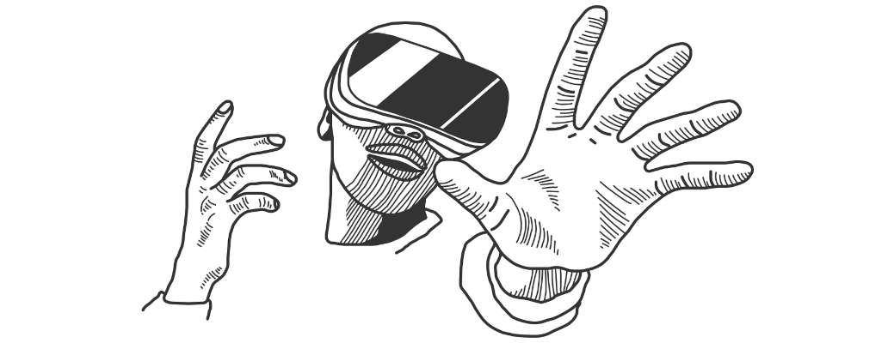
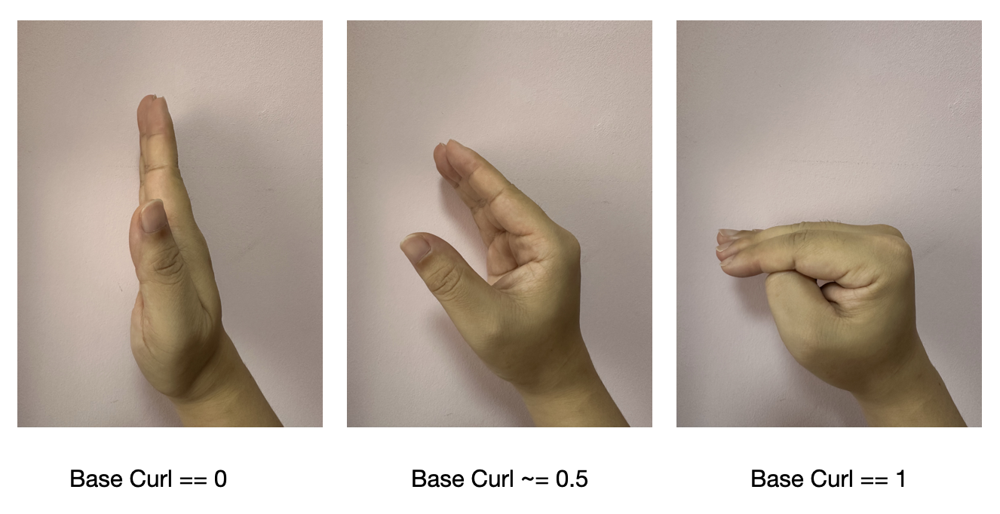
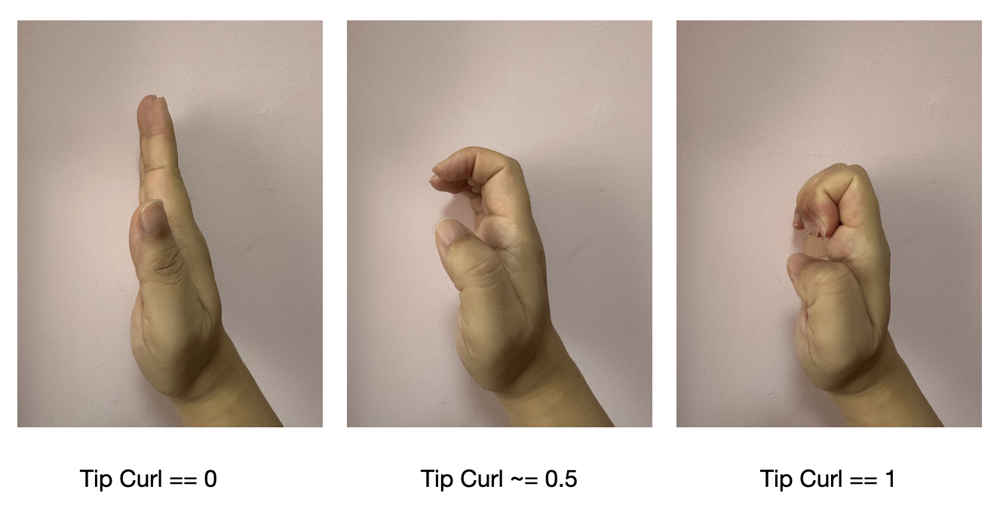
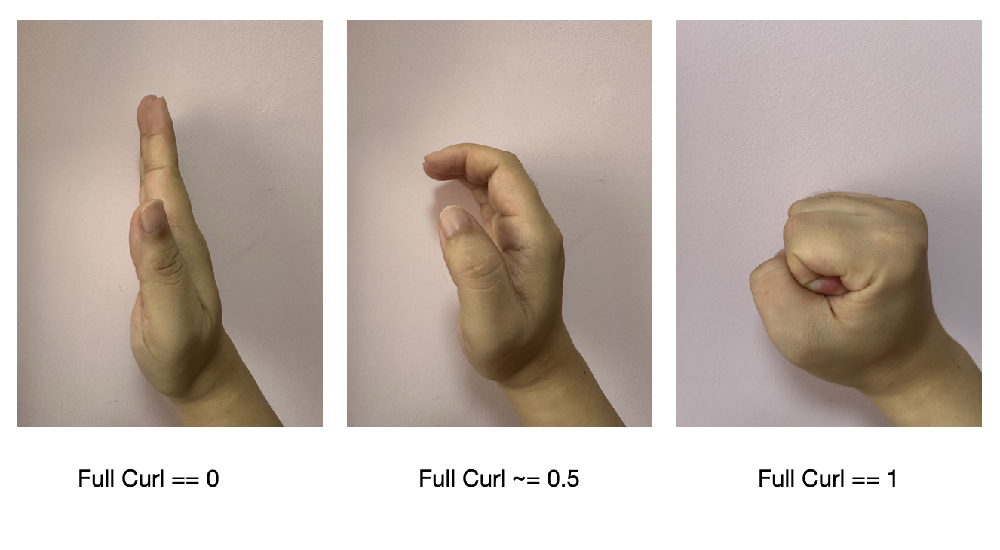
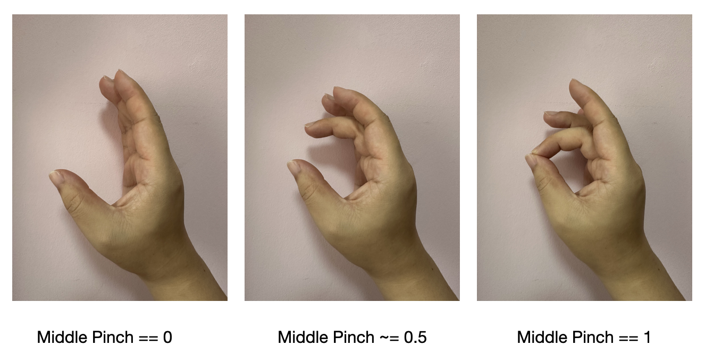
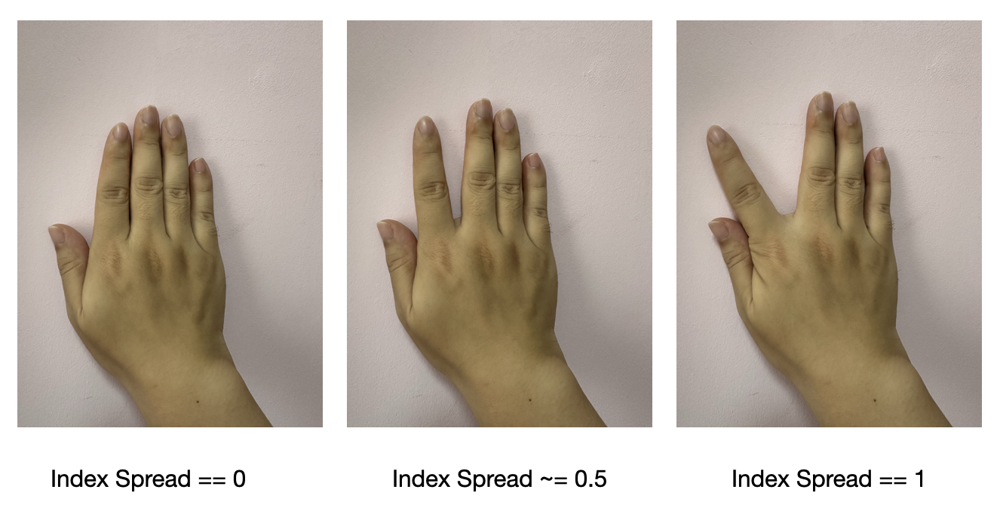
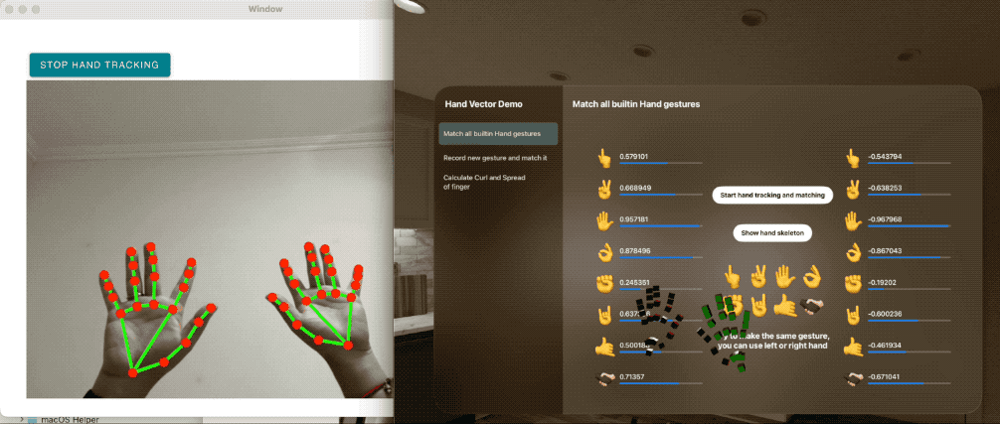

<p align="center">
    
</p>
<p align="center">
  <a href="https://github.com/apple/swift-package-manager"></a>
  
  
</p>

[English](./README.md)

**HandVector** 在 vsionOS 上计算不同静态手势之间的相似度，并且带有一个 macOS 的工具类能让你在 visionOS 模拟器上也能使用手势追踪功能。

HandVector 2.0 版本是一个大更新，带来更好的 **余弦相似度Cosine Similarity** 匹配效果和 **手指形状参数FingerShape** 功能，更方便自定义使用。

> 注意：HandVector 2.0 有重大 API 改动，与旧版本不兼容。

<p align="center">
    <a href="#requirements">环境要求</a> • <a href="#usage">用法</a> • <a href="#installation">安装</a> • <a href="#contribution">贡献</a> • <a href="#contact">联系方式</a> • <a href="#license-mit">许可证</a>
</p>


## 环境要求

- visionOS 1.0+
- Xcode 15.2+
- Swift 5.9+

## 用法

`HandVector 2.0` 支持两种手势匹配方法，它们计算理念不同，适用不同情况，也可一起混合使用：

* **余弦相似度Cosine Similarity**：完全匹配指定手指的每个关节，使用每个关节点相对于父关节的矩阵信息，精准度高。优点：精度高，可适用手指与手腕；缺点：可解释性差，难以调整范围。
* **手指形状参数FingerShape**：参考 Unity 的 [XRHands](https://docs.unity3d.com/Packages/com.unity.xr.hands@1.5/manual/index.html) 框架，将手指形状化简为： `指根卷曲度 baseCurl`、 `指尖卷曲度 tipCurl`、 `整体卷曲度 fullCurl`、 `（与拇指）捏合度 pinch`、 `（与外侧相邻手指）分离度 spread` 5 个参数。优点：数值方便理解，方便控制与调整；缺点：未充分利用关节位姿信息，精度不够高，且只适用 5 根手指。


### 1.余弦相似度手势匹配

`HandVector` 支持匹配内置的手势，也支持自行录制保存自定义手势。目前内置的手势有 8 种：👆✌️✋👌✊🤘🤙🫱🏿‍🫲🏻

> 🫱🏿‍🫲🏻：握、抓住

#### a.匹配内置的手势


追踪双手关节的姿态，并与内置的手势相比较，得出它们的相似度。

```swift
import HandVector

//从 HandTrackingProvider 中获取当前手部信息，并转换为 `HVHandInfo`
for await update in handTracking.anchorUpdates {
    switch update.event {
    case .added, .updated:
        let anchor = update.anchor
        guard anchor.isTracked else { continue }
        let handInfo = latestHandTracking.generateHandInfo(from: anchor)
    case .removed:
        ...
    }
}

//从 json 文件中加载内置的手势
let builtinHands = HVHandInfo.builtinHandInfo
//计算与内置手势的相似度,`.fiveFingers`表示只匹配 5 根手指，忽略手腕和手掌
builtinHands.forEach { (key, value) in
    leftScores[key] = latestHandTracking.leftHandVector?.similarity(of: .fiveFingers, to: value)
    rightScores[key] = latestHandTracking.rightHandVector?.similarity(of: .fiveFingers, to: value)
}
```

相似度得分在 `[-1.0,1.0]` 之间， `1.0` 含义为手势完全匹配并且左右手也匹配， `-1.0 ` 含义为手势完全匹配但一个是左手一个是右手， `0` 含义为完全不匹配。

#### b. 录制自定义的新手势并匹配它


录制自定义手势，并利用 `HVHandJsonModel` 保存为 JSON 字符串:

```swift
if let left = model.latestHandTracking.leftHandVector {
    let para = HVHandJsonModel.generateJsonModel(name: "YourHand", handVector: left)
    jsonString = para.toJson()
    //保存 jsonString 到磁盘或网络
    ...
}
```

然后，将保存的 JSON 字符串转换为 `HVHandInfo` 类型进行手势匹配：

```swift
//从 JSON 字符串转换
let handInfo = jsonStr.toModel(HVHandJsonModel.self)!.convertToHVHandInfo()
//从磁盘加载 JSON 并转换
let handInfo = HVHandJsonModel.loadHandJsonModel(fileName: "YourJsonFileName")!.convertToHVHandInfo()

//用 `HVHandInfo` 类型进行手势匹配，可以将每根手指单独计算相似度
if let handInfo {
    averageAndEachLeftScores = latestHandTracking.leftHandVector?.averageAndEachSimilarities(of: .fiveFingers, to: recordHand)
    averageAndEachRightScores = latestHandTracking.rightHandVector?.averageAndEachSimilarities(of: .fiveFingers, to: recordHand)
}

```

### 2.手指形状参数FingerShape



该方法重点参考了 Unity 中知名 XR 手势框架：[XRHands](https://docs.unity3d.com/Packages/com.unity.xr.hands@1.5/manual/index.html) 。


相关参数的定义也类似：

*  **指根卷曲度 baseCurl**：手指根部关节的卷曲度，大拇指为 `IntermediateBase` 关节，其余手指为 `Knuckle` 关节，范围 0～1



*  **指尖卷曲度 tipCurl**：手指上部关节的卷曲度，大拇指为 `IntermediateTip` 关节，其余手指为 `IntermediateBase` 和 `IntermediateTip` 两个关节的平均值，范围 0～1



* **整体卷曲度 fullCurl**：baseCurl 与 tipCurl 的平均值，范围 0～1



* **（与拇指）捏合度 pinch**：计算与拇指指尖的距离，范围 0～1，拇指该参数为 `nil`



* **（与外侧相邻手指）分离度 spread**：只计算水平方向上的夹角，范围 0～1，小拇指该参数为 `nil`



关于三个不同的卷曲度有什么区别，可以参考下图：


### 3. 在模拟器上测试

`HandVector` 中的模拟器测试方法来自于  [VisionOS Simulator hands](https://github.com/BenLumenDigital/VisionOS-SimHands) 项目,  它提供了一种可以在模拟器上测试手部追踪的方法:

它分为 2 部分:

1. 一个 macOS 工具 app, 带有 bonjour 网络服务
2. 一个 Swift 类，用来在你的项目中连接到 bonjour 服务（本 package 中已自带，并自动接收转换为对应手势，HandVector 2.0 版本中更新了大量数学“黑魔法”来实现新的匹配算法)

#### macOS Helper App

这个工具 app 使用了 Google 的 MediaPipes 来实现 3D 手势追踪。工具中只是一段非常简单的代码——它使用一个WKWebView 来运行 Google 的示例代码，并将捕获到的手部数据作用 JSON 传递到原生 Swift 代码中。

然后通过 Swift 代码将 JSON 信息通过 Bonjour 服务广播出去。

> 如果手势识别长时间无法启动（按钮一直无法点击），请检查网络是否能连接到 google MediaPipes。（中国用户请特别注意网络）



### 其他...

更多详情，请查看 demo 工程。


## 安装

#### Swift Package Manager

要使用苹果的 Swift Package Manager 集成，将以下内容作为依赖添加到你的 `Package.swift`：

```
.package(url: "https://github.com/XanderXu/HandVector.git", .upToNextMajor(from: "2.0.0"))
```

#### 手动

[下载](https://github.com/XanderXu/HandVector/archive/master.zip) 项目，然后复制 `HandVector` 文件夹到你的工程中就可以使用了。

## 贡献

欢迎贡献代码 *♡*.

## 联系我

Xander: API 搬运工

* [https://twitter.com/XanderARKit](https://twitter.com/XanderARKit)
* [https://github.com/XanderXu](https://github.com/XanderXu)

 - [https://juejin.cn/user/2629687543092056](https://juejin.cn/user/2629687543092056)

   

## 许可证

HandVector 是在 MIT license 下发布的。更多信息可以查看 [LICENSE](./LICENSE)。
