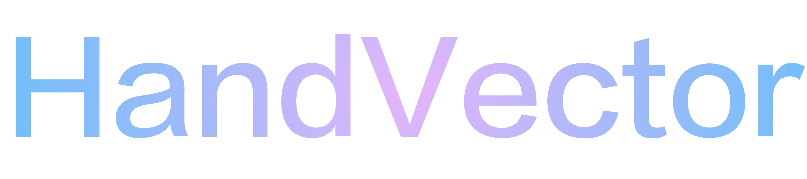
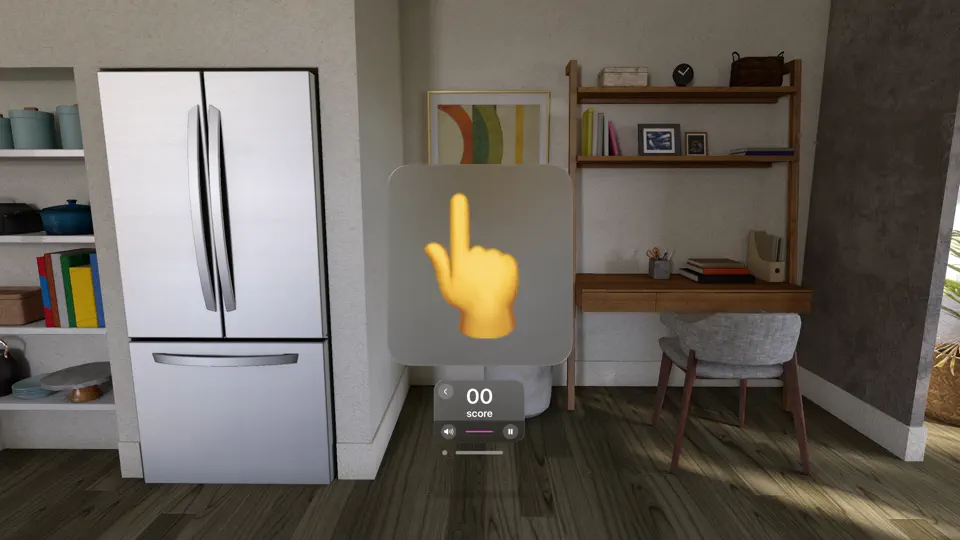
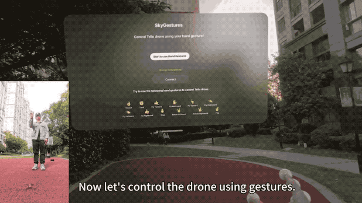
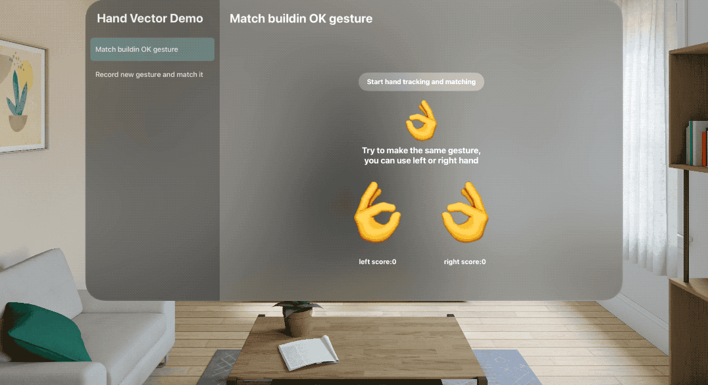
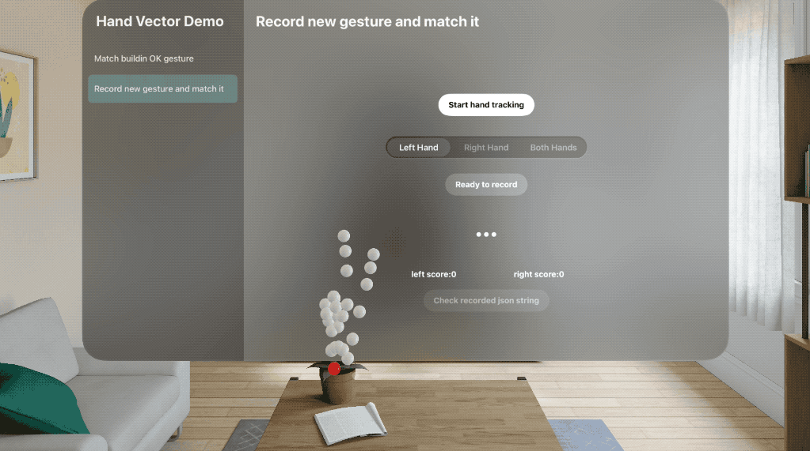
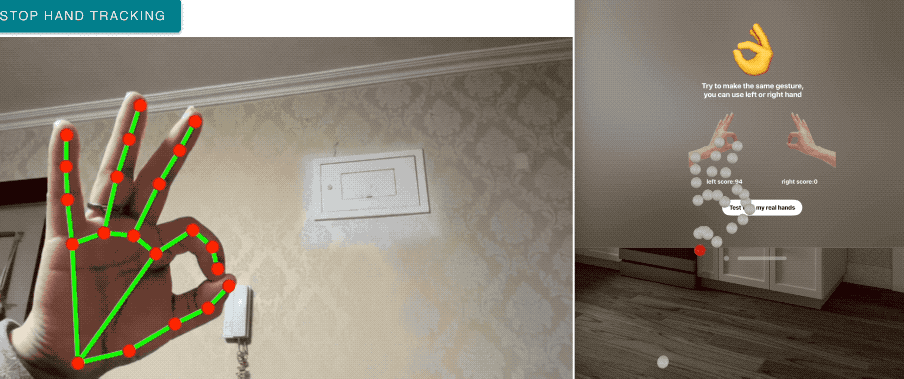

<p align="center">
    
</p>
<p align="center">
  <a href="https://github.com/apple/swift-package-manager"></a>
  
  
</p>
[English Version](./README.md)

[旧版本](./READMEv1/README_CN.md)

**HandVector** 使用**余弦相似度**算法，在 vsionOS 上计算不同手势之间的相似度，还带有一个 macOS 的工具类能让你在 visionOS 模拟器上也能使用手势追踪功能。

<p align="center">
    <a href="#requirements">环境要求</a> • <a href="#usage">用法</a> • <a href="#installation">安装</a> • <a href="#contribution">贡献</a> • <a href="#contact">联系方式</a> • <a href="#license-mit">许可证</a>
</p>


## 环境要求

- visionOS 1.0+
- Xcode 15.2+
- Swift 5.9+

## 用法

你可以下载运行软件包中的 demo 工程来查看如何使用，也可以从 App Store 中下载使用了 **HandVector** 的 App 来查看功能演示：

1. [FingerEmoji](https://apps.apple.com/us/app/fingeremoji/id6476075901) : FingerEmoji 让你的手指与 Emoji 共舞，你可以做出相同的手势并撞击 Emoji 卡片得分。

   

2. [SkyGestures](https://apps.apple.com/us/app/skygestures/id6499123392): **[SkyGestures](https://github.com/zlinoliver/SkyGestures)** 使用 Vision Pro 上的手势来控制大疆 DJI Tello 无人机，并且目前它已经 [开源](https://github.com/zlinoliver/SkyGestures) 了！

   


### 1.匹配内置的 OK 手势



`HandVector` 可以让你追踪双手关节的姿态，并与先前记录下的手势相比较，得出它们的相似度:

```swift
import HandVector

//从 json 文件中加载先前记录下的手势
model.handEmojiDict = HandEmojiParameter.generateParametersDict(fileName: "HandEmojiTotalJson")!
guard let okVector = model.handEmojiDict["👌"]?.convertToHandVectorMatcher(), let leftOKVector = okVector.left else { return }

//从 HandTrackingProvider 中获取当前手势，并更新
for await update in handTracking.anchorUpdates {
    switch update.event {
    case .added, .updated:
        let anchor = update.anchor
        guard anchor.isTracked else { continue }
        await latestHandTracking.updateHand(from: anchor)
    case .removed:
        ...
    }
}


//计算相似度
let leftScore = model.latestHandTracking.leftHandVector?.similarity(to: leftOKVector) ?? 0
model.leftScore = Int(abs(leftScore) * 100)
let rightScore = model.latestHandTracking.rightHandVector?.similarity(to: leftOKVector) ?? 0
model.rightScore = Int(abs(rightScore) * 100)
```

相似度得分在 `[-1.0,1.0]` 之间， `1.0` 含义为手势完全匹配并且左右手也匹配， `-1.0 ` 含义为手势完全匹配但一个是左手一个是右手， `0` 含义为完全不匹配。

### 2. 录制自定义的新手势并匹配它



`HandVector` 允许你录制你的自定义手势，并保存为 JSON 字符串:

```swift
let para = HandEmojiParameter.generateParameters(name: "both", leftHandVector: model.latestHandTracking.leftHandVector, rightHandVector: model.latestHandTracking.rightHandVector)
model.recordHand = para

jsonString = para?.toJson()
```

然后，你还可以将 JSON 字符串转换为 `HandVectorMatcher` 类型，这样就可以进行手势匹配了：

```swift
guard let targetVector = model.recordHand?.convertToHandVectorMatcher(), targetVector.left != nil || targetVector.right != nil else { return }

let targetLeft = targetVector.left ?? targetVector.right
let targetRight = targetVector.right ?? targetVector.left

let leftScore = model.latestHandTracking.leftHandVector?.similarity(of: HandVectorMatcher.allFingers, to: targetLeft!) ?? 0
model.leftScore = Int(abs(leftScore) * 100)
let rightScore = model.latestHandTracking.rightHandVector?.similarity(of: HandVectorMatcher.allFingers, to: targetRight!) ?? 0
model.rightScore = Int(abs(rightScore) * 100)
```


### 3. 在模拟器上测试

`HandVector` 中的模拟器测试方法来自于  [VisionOS Simulator hands](https://github.com/BenLumenDigital/VisionOS-SimHands) 项目,  它提供了一种可以在模拟器上测试手部追踪的方法:

它分为 2 部分:

1. 一个 macOS 工具 app, 带有 bonjour 网络服务
2. 一个 Swift 类，用来在你的项目中连接到 bonjour 服务（本 package 中已自带，并自动接收转换为对应手势)

#### macOS Helper App

这个工具 app 使用了 Google 的 MediaPipes 来实现 3D 手势追踪。工具中只是一段非常简单的代码——它使用一个WKWebView 来运行 Google 的示例代码，并将捕获到的手部数据作用 JSON 传递到原生 Swift 代码中。

然后通过 Swift 代码将 JSON 信息通过 Bonjour 服务广播出去。

> 如果手势识别长时间无法启动（按钮一直无法点击），请检查网络是否能连接到 google MediaPipes。（中国用户请特别注意网络）



### 其他...

更多详情，请查看 demo 工程。


## 安装

#### Swift Package Manager

要使用苹果的 Swift Package Manager 集成，将以下内容作为依赖添加到你的 `Package.swift`：

```
.package(url: "https://github.com/XanderXu/HandVector.git", .upToNextMajor(from: "0.3.0"))
```

#### 手动

[下载](https://github.com/XanderXu/HandVector/archive/master.zip) 项目，然后复制 `HandVector` 文件夹到你的工程中就可以使用了。

## 贡献

欢迎贡献代码 *♡*.

## 联系我

Xander: API 搬运工

* [https://twitter.com/XanderARKit](https://twitter.com/XanderARKit)
* [https://github.com/XanderXu](https://github.com/XanderXu)

 - [https://juejin.cn/user/2629687543092056](https://juejin.cn/user/2629687543092056)

   

## 许可证

HandVector 是在 MIT license 下发布的。更多信息可以查看 [LICENSE](./LICENSE)。
